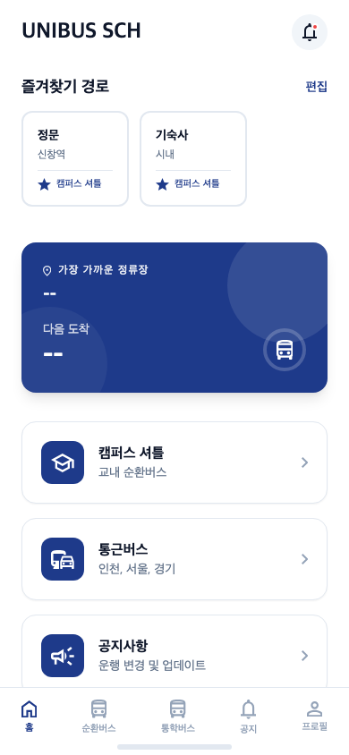
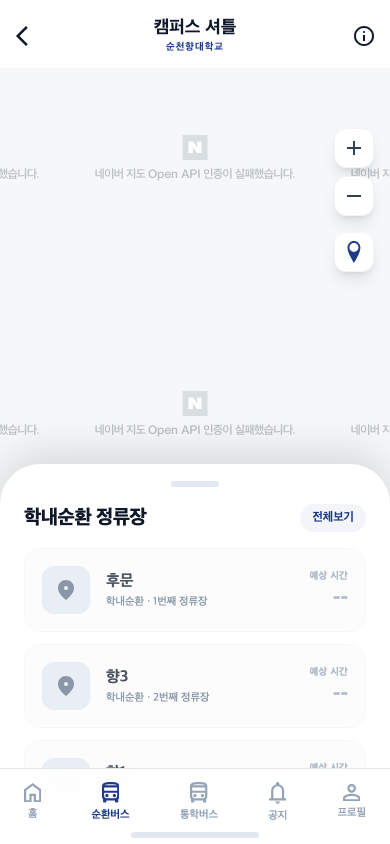
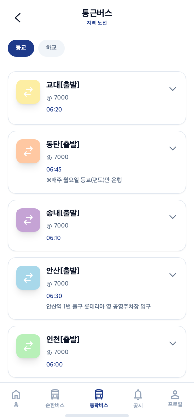
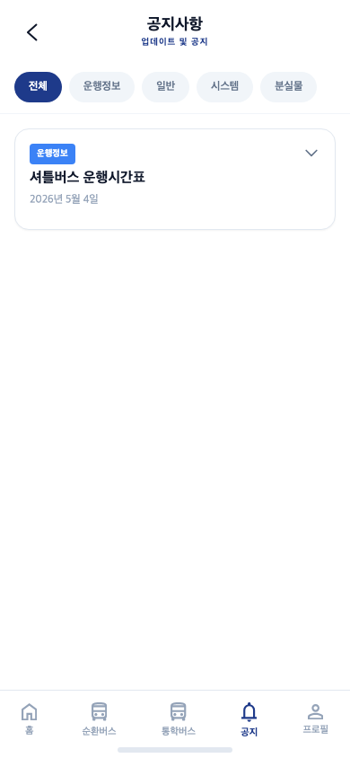
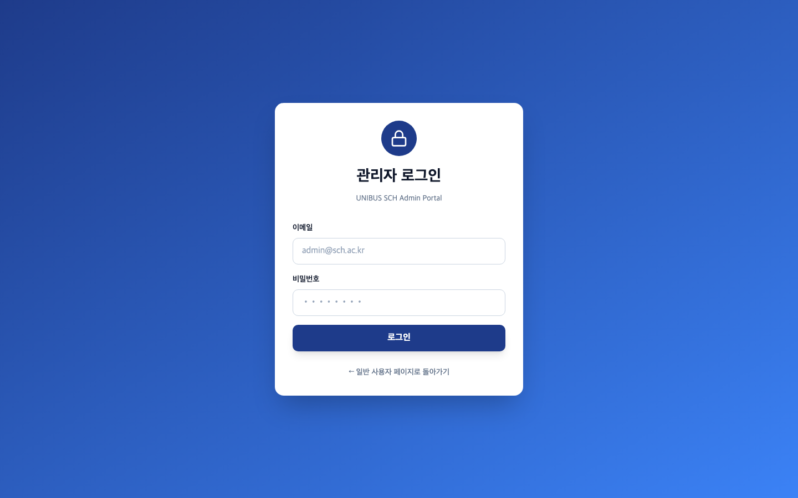
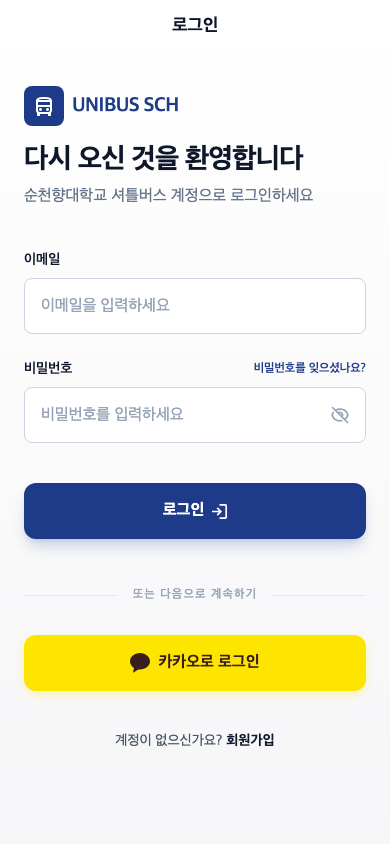

# UNIBUS SCH — 순천향대학교 셔틀버스 앱

순천향대학교 학내순환버스와 통학버스의 **실시간 위치 추적**, **노선 조회**, **공지사항**을 제공하는 모바일 웹 앱입니다.

**배포 주소**: https://unibus-146wsy716-ddingddong9s-projects.vercel.app

---

## 화면 미리보기

### 일반 사용자

<table>
  <tr>
    <td align="center"><b>로그인</b></td>
    <td align="center"><b>홈</b></td>
    <td align="center"><b>학내순환 지도</b></td>
    <td align="center"><b>통학버스</b></td>
    <td align="center"><b>공지사항</b></td>
  </tr>
  <tr>
    <td></td>
    <td></td>
    <td></td>
    <td></td>
    <td></td>
  </tr>
</table>

### 관리자 / 버스 기사

<table>
  <tr>
    <td align="center"><b>관리자 로그인</b></td>
    <td align="center"><b>버스 기사 로그인</b></td>
  </tr>
  <tr>
    <td></td>
    <td></td>
  </tr>
</table>

---

## 사용자 역할 구분

UNIBUS SCH는 세 가지 역할로 운영됩니다.

| 역할 | 접근 경로 | 설명 |
|------|-----------|------|
| 일반 사용자 | `/login` | 학생·교직원이 사용하는 메인 앱 |
| 관리자 | `/admin/login` | 버스·노선·공지 관리, 데모 시뮬레이션 |
| 버스 기사 | `/driver` | GPS 기반 실시간 위치 전송 |

---

## 일반 사용자 기능

### 로그인
- **이메일/비밀번호** 또는 **카카오 소셜 로그인** 지원
- 회원가입 시 학번 입력 (선택)

### 홈 화면
- 즐겨찾기 경로 바로가기 카드
- 가장 가까운 정류장 및 **학내순환 운행 중 여부** 실시간 표시
- 캠퍼스 셔틀 / 통학버스 / 공지사항 퀵 메뉴

### 학내순환 지도 (`/campus-shuttle`)
- **네이버 지도** 기반 실시간 버스 위치 표시
- Supabase Realtime으로 2초 이내 위치 업데이트
- 정류장 목록 바텀 시트 (드래그 가능)
  - 후문 → 향3 → 향1 → 도서관 → 정문 순환
  - 각 정류장 예상 도착 시간 표시
- 내 위치 버튼으로 현재 위치 확인

### 통학버스 (`/commuter-bus`)
- 지역별 노선 필터 (교대 출발 / 동탄 / 송내 / 안산 / 인천 등)
- 노선 카드 클릭 시 상세 정보 펼침
  - 출발 시간, 요금, 운행 일정, 경유 정류장
  - **운행 중 배지** + **예상 도착 시간** 실시간 표시 (버스 운행 시)
  - **PAYCO로 예약하기** 버튼 (PAYCO 앱 딥링크 연결)
- 활성 통학버스가 있을 경우 **광역 실시간 지도** 자동 표시

### 공지사항 (`/notice`)
- 카테고리별 필터: 운행정보 / 일반 / 시스템 / 분실물
- 공지 클릭 시 상세 내용 확인

---

## 관리자 기능 (`/admin`)

관리자 계정은 `/admin/login` 에서 별도 로그인합니다.

### 대시보드
- 전체 버스 수 / 활성 노선 / 공지사항 / 가입 사용자 현황 카드
- 최근 공지사항 목록
- API 서버 / DB / Edge Function 상태 확인
- **30초 자동 갱신** (백그라운드 silent 업데이트)

### 데모 시뮬레이션
학술제·시연 등에서 **다중 버스 동시 운행**을 시뮬레이션합니다.

1. 대시보드 하단 "데모 시뮬레이션" 패널 확인
2. DB에 등록된 버스가 자동으로 역할 배정됨:
   - `campus` 타입 버스 → 학내 순환 경로 (후문→향3→향1→도서관→정문 반복)
   - `commuter` 타입 버스 → 서울행 / 인천행 (홀짝 교대)
3. **시뮬레이션 시작** 버튼 클릭 → 모든 버스 2초 간격으로 위치 전송
4. 학내순환 지도 및 통학버스 탭에서 실시간으로 확인 가능
5. **시뮬레이션 종료** 버튼으로 원상 복구

### 공지사항 관리 (`/admin/notices`)
- 공지 작성 / 수정 / 삭제
- 카테고리 · 우선순위 · 중요 공지 고정 설정

### 노선 관리 (`/admin/routes`)
- 노선 추가 / 수정 / 비활성화
- 정류장 목록 및 순서 편집

### 버스 관리 (`/admin/buses`)
- 버스 등록 (이름, 유형, 차량번호, 정원)
- 버스 삭제 (운행 중인 버스는 삭제 불가)

### 사용자 관리 (`/admin/users`)
- 전체 사용자 목록 조회
- 역할 변경 (user / driver / admin)

---

## 버스 기사 기능 (`/driver`)

버스 기사 계정은 일반 로그인 화면(`/login`)에서 로그인합니다. (관리자가 역할 부여)

### 운행 시작
1. 로그인 후 배정된 버스 목록 확인
2. 운행할 버스 선택 → **운행 시작** 버튼 클릭

### 운행 중 화면
- **GPS 실시간 추적** — `navigator.geolocation.watchPosition` 으로 고정밀 위치 수신
- **5초마다 서버 전송** — 위도/경도/속도/방위각(heading) 자동 계산 후 업데이트
  - heading은 이전 좌표와 현재 좌표 사이의 bearing을 계산해 버스 아이콘 방향 반영
- 운행 경과 시간, GPS 수신 상태, 위치 전송 횟수, 현재 속도 표시
- **운행 종료** 버튼 → 버스 상태 `inactive` 전환

---

## 기술 스택

| 구분 | 기술 |
|------|------|
| 프론트엔드 | React 18, Vite, TypeScript, Tailwind CSS, Framer Motion |
| 지도 | 네이버 지도 API (Directions 5) |
| 백엔드 | Spring Boot (마이그레이션 API) + Supabase Edge Functions (잔여 API) |
| 데이터베이스 | Supabase PostgreSQL + Realtime |
| 인증 | 자체 토큰 인증 + 카카오 소셜 로그인 |
| 배포 | Vercel (프론트엔드), Supabase (DB·Realtime·Storage·잔여 Edge API); Spring 운영 배포는 아직 미전환 |
| PWA | Vite PWA Plugin (오프라인 지원, 앱 설치 가능) |

---

## 로컬 개발 환경 설정

### 필수 도구

- **Node.js** 18+
- **Docker Desktop** (Supabase 로컬 실행용)
- **Supabase CLI** — `brew install supabase/tap/supabase`

### 실행 순서 (터미널 3개)

```bash
# 1. Supabase 인프라 시작 (DB, Auth, Realtime)
supabase start

# 2. Spring API 실행 (backend/.env.example 참고)
cd backend
./gradlew bootRun

# 3. 프론트엔드 개발 서버 (프로젝트 루트)
npm run dev
# → http://localhost:5173
```

### 환경변수 설정

`.env.local` 파일을 생성하고 아래 값을 입력합니다.

```env
VITE_SUPABASE_URL=http://localhost:54321
VITE_SUPABASE_PROJECT_ID=your_project_id
VITE_SUPABASE_ANON_KEY=your_anon_key
VITE_PUBLIC_API_BASE_URL=http://localhost:8080
VITE_AUTH_API_BASE_URL=http://localhost:8080
VITE_ADMIN_API_BASE_URL=http://localhost:8080
VITE_DRIVER_API_BASE_URL=http://localhost:8080
VITE_NAVER_CLIENT_ID=your_naver_client_id
VITE_KAKAO_APP_KEY=your_kakao_app_key
```

### 데이터베이스 마이그레이션

```bash
supabase db reset   # 마이그레이션 + 시드 데이터 초기화
```

Spring은 시작 시 필요한 Supabase 테이블·컬럼·함수를 읽기 전용으로 검사하며 스키마를
자동 변경하지 않습니다. 프런트 프로덕션 빌드는 `npm run build` 전에 필수 환경변수와
localhost 오설정을 검사합니다. 상세 전환 조건은 `backend/docs/production-readiness.md`를
참조하세요.

---

## 프로젝트 구조

```
unibus-sch/
├── src/
│   ├── app/
│   │   ├── screens/          # 사용자 화면 (Home, CampusShuttle, CommuterBus, Notice)
│   │   ├── admin/            # 관리자 화면 (Dashboard, Notices, Routes, Buses, Users)
│   │   ├── screens/driver/   # 버스 기사 화면
│   │   ├── components/       # 공유 컴포넌트 (NaverMap, BottomNav 등)
│   │   ├── services/api.ts   # API 클라이언트
│   │   └── types/            # TypeScript 타입 정의
│   └── utils/supabase/       # Supabase 클라이언트 설정
├── supabase/
│   ├── functions/make-server/ # Edge Functions (Hono 라우터)
│   │   ├── routes/            # auth, buses, campus, driver, notices, routes
│   │   └── middleware/auth.tsx # 인증 미들웨어
│   └── migrations/            # DB 스키마 마이그레이션
├── docs/screenshots/          # 앱 화면 스크린샷
└── vercel.json                # Vercel 배포 설정 (SPA 라우팅)
```

---

## 협업 브랜치 전략

- `main` — 항상 배포 가능한 상태 유지
- `feat/기능명` — 기능 개발 브랜치
- PR 머지 전 팀원 코드 리뷰 필수

---

## 알려진 제한사항

- 네이버 지도 API는 허용된 도메인에서만 작동합니다. 로컬 개발 시 `localhost`를 NCP 콘솔에 등록해야 합니다.
- 통학버스 PAYCO 예약은 PAYCO 앱이 설치된 기기에서만 앱 딥링크가 동작합니다. 미설치 시 앱스토어로 이동합니다.
- 버스 기사 계정은 관리자가 `/admin/users`에서 역할을 `driver`로 변경해야 앱에 접근 가능합니다.
